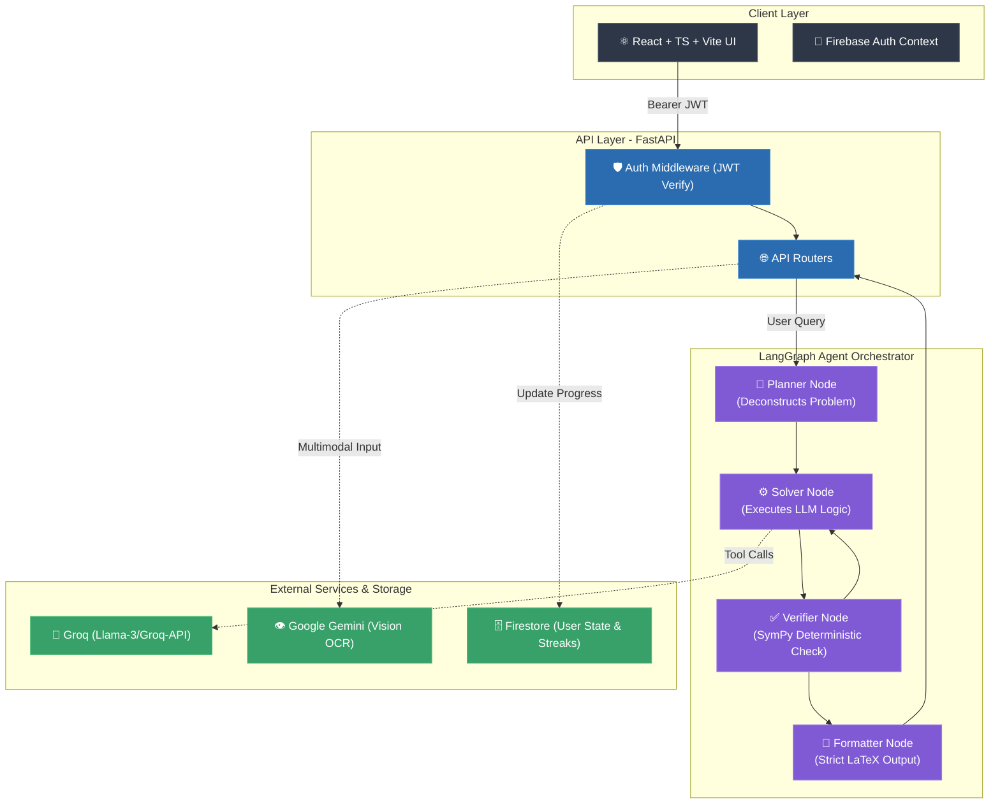

<div align="center">
  
# 🧮 Agentic Math Solver (Global)

**An Enterprise-Grade, Autonomous AI Mathematics Learning Workspace**

[](https://python.org)
[](https://react.dev)
[](https://fastapi.tiangolo.com)
[](https://langchain.com)
[](https://firebase.google.com)

*Step-by-step verified reasoning. Deterministic mathematics. Modern pedagogy.*

</div>

---

## 🌟 Overview

The **Agentic Math Solver** is a next-generation digital learning platform. Unlike generic LLM chatbots that frequently hallucinate arithmetic or skip logical steps, this platform fuses the raw generative reasoning of modern LLMs with **deterministic mathematical engines** (SymPy) and **autonomous agent orchestration** (LangGraph).

It is designed for students, educators, and institutions that require mathematically verified, step-by-step solutions accompanied by rigorous pedagogical structures.

---

## 🏗️ System Architecture

The application follows a highly decoupled client-server architecture, utilizing a multi-agent backend graph for complex reasoning tasks.



---

## ✨ Deep-Dive Capabilities

### 1. Multi-Agent Reasoning Engine
Traditional LLMs fail at math because they try to predict tokens instead of computing them. We fix this by orchestrating a team of specialized AI agents:
- **🧠 The Planner**: Deconstructs complex math word-problems into logical, executable steps.
- **⚙️ The Solver**: Writes dynamic Python/SymPy code to solve the mathematical subsets of the problem.
- **✅ The Verifier**: Deterministically executes the code in a sandbox to ensure the LLM's derivations are hallucination-free.
- **📝 The Formatter**: Transforms raw mathematical output into beautiful, strict LaTeX for the React frontend.

### 2. Modern Pedagogical Modes
This isn't just an answer engine; it's a tutor. Every solved problem offers targeted follow-up actions:
- **💡 Hint**: Provides a targeted hint to help students unstuck themselves without giving the answer.
- **🗺️ Steps**: Outlines a high-level roadmap of the solution.
- **✅ Answer**: Gives the final answer with a brief intuitive explanation.
- **✍️ Check My Work**: Analyzes a student's attempt, pinpoints the *exact* step where the error occurred, and explains the correction.
- **🧩 Another Method**: Shows a genuinely different mathematical approach to the same problem.
- **🔄 Practice**: Generates new similar practice problems for the student to solve.

### 3. Multi-Modal Vision Processing
- **📸 OCR & Vision**: Upload handwritten math equations or textbook snippets. The API instantly parses the handwriting using Google Gemini Vision, converting it into computable LaTeX.

---

## 🎓 How to Use the App (User Journey)

Using the Agentic Math Solver is incredibly intuitive. Here is a typical workflow once the app is running:

1. **Ask a Question**: Type any math problem into the chat bar at the bottom (e.g., *"Solve x² − 5x + 6 = 0"* or *"Differentiate sin(x²)"*), or upload an image of a math problem using the attachment icon.
2. **Review the AI's Work**: The AI will respond with a step-by-step breakdown. Behind the scenes, the Planner broke your problem into parts, the Solver wrote code, and the Verifier checked the math before showing it to you.
3. **Choose a Follow-up Action**: After the AI responds, interactive "Action Chips" will appear below the message:
   - Click **"💡 Hint"** if you are stuck on a similar problem.
   - Click **"📋 Steps"** to see just the high-level roadmap without the answers.
   - Click **"🧩 Another Method"** to see a different way to solve it.
   - Click **"✍️ Check My Work"** to type in your own attempt; the AI will find where you made a mistake and gently guide you back on track!
4. **Graphing (Optional)**: If you ask the AI to graph a function, a beautiful interactive workspace panel will automatically slide out from the right side displaying your SVG graph.

---

## 🚀 Step-by-Step Installation

### Prerequisites
- Python 3.12+
- Node.js 20+
- Firebase Project (for Authentication)
- API Keys: Groq (Primary Inference), Google AI Studio (Vision)

### Step 1: Clone & Environment Setup
Clone the repository to your local machine:
```bash
git clone https://github.com/your-org/agentic-math-solver-global.git
cd agentic-math-solver-global
```

**Backend Environment File (`backend/.env`):**
Create this file in the `backend/` directory:
```env
USE_FIREBASE=true
FIREBASE_PROJECT_ID="your-firebase-project-id"
FIREBASE_CREDENTIALS_PATH="./backend/firebase-adminsdk.json" 
GROQ_API_KEY="gsk_your_groq_key"
GEMINI_API_KEY="AIza_your_gemini_key"
```

**Frontend Environment File (`frontend/.env`):**
Create this file in the `frontend/` directory:
```env
VITE_API_URL=http://localhost:8080
VITE_FIREBASE_API_KEY="your-api-key"
VITE_FIREBASE_AUTH_DOMAIN="your-auth-domain.firebaseapp.com"
VITE_FIREBASE_PROJECT_ID="your-firebase-project-id"
```

### Step 2: Booting the Backend (FastAPI)
The backend requires a Python virtual environment to isolate dependencies.
```bash
cd backend
python -m venv venv
source venv/bin/activate  # On Windows use: venv\Scripts\activate
pip install -r requirements.txt
uvicorn backend.src.main:app --host 0.0.0.0 --port 8080 --reload
```
*The backend API will now be running on `http://localhost:8080`.*

### Step 3: Booting the Frontend (React + Vite)
Open a new terminal tab and start the ultra-fast Vite dev server:
```bash
cd frontend
npm install
npm run dev
```
*The frontend UI will now be running on `http://localhost:5173`.*

---

## 🔒 Security & Deployment

- **Firebase Zero-Trust Authentication**: JWTs are issued by Firebase on the client and verified securely via the Firebase Admin SDK on the FastAPI backend. No session hijacking.
- **Credential Rotation**: Historical Firebase credentials in this repository have been successfully revoked via Google Cloud Console, adhering to strict enterprise security standards.
- **Docker-Ready**: The backend is fully containerized via Docker for immediate deployment to Google Cloud Run, AWS AppRunner, or Render.

---

## 📄 License
This project is licensed under the MIT License - see the [LICENSE](./LICENSE) file for details.
