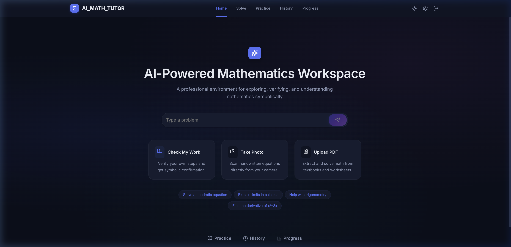
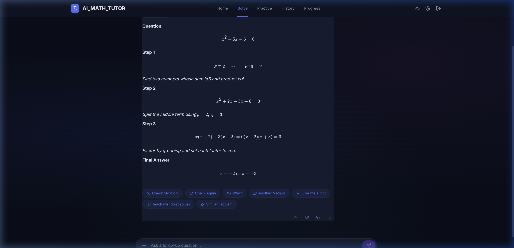
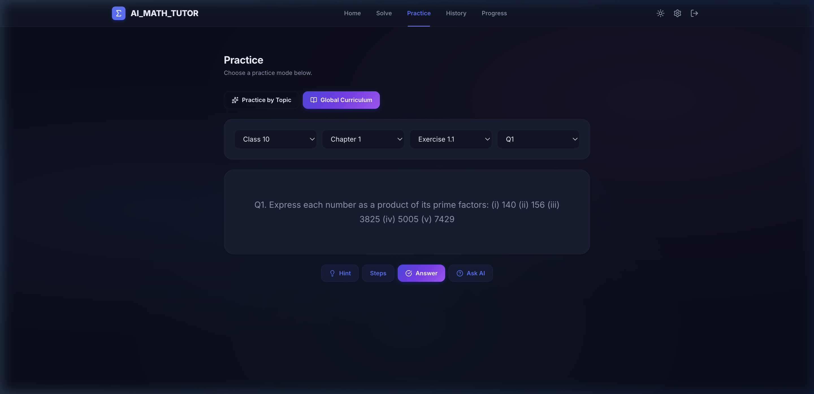
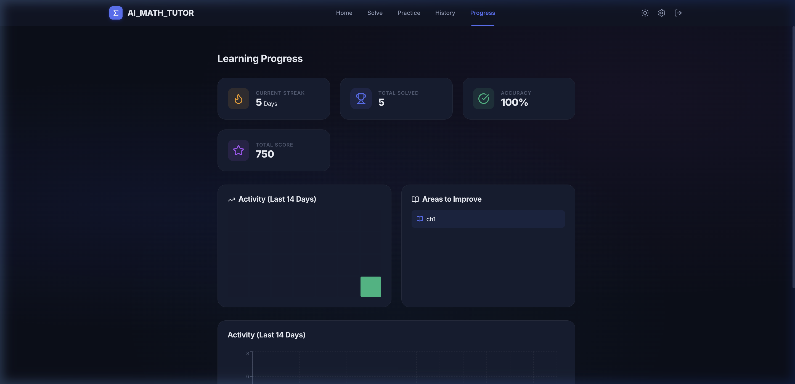
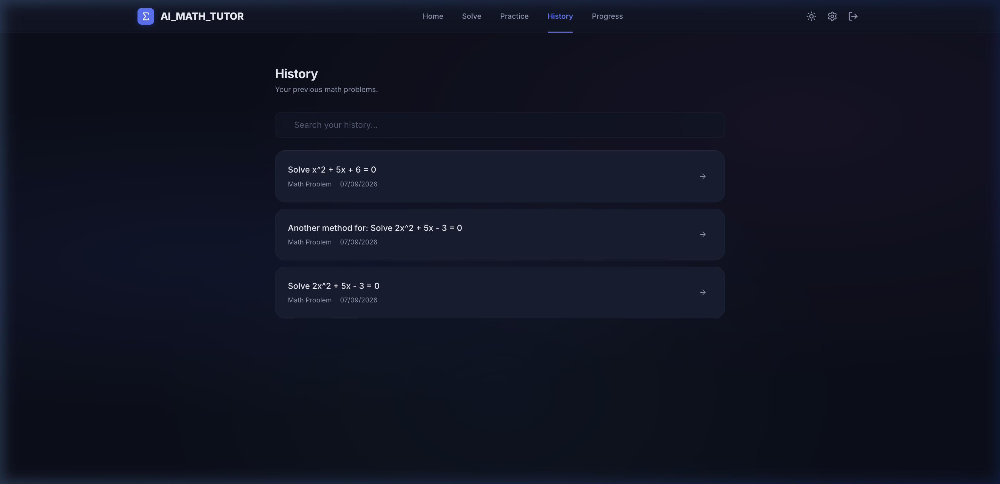
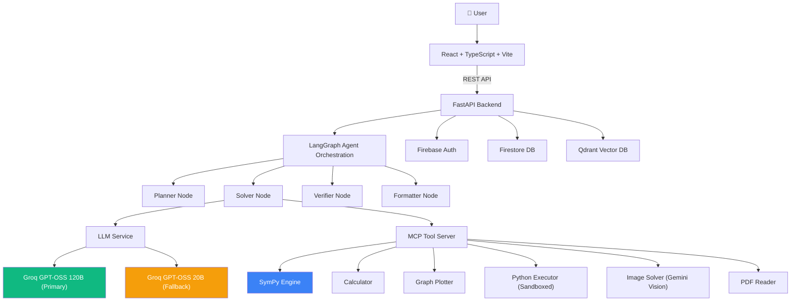

<](https://python.org)
[](https://typescriptlang.org)
[](https://fastapi.tiangolo.com)
[](https://react.dev)
[](https://langchain-ai.github.io/langgraph/)
[](./LICENSE)

---

## What Is This?

Agentic Math Solver is a **digital mathematics learning workspace** — not a generic chatbot. It combines:

- **Agentic AI reasoning** via LangGraph (plan → solve → verify → format)
- **Deterministic symbolic verification** via SymPy (catches LLM arithmetic errors)
- **Action-specific pedagogical modes** (Hint, Steps, Teach Me, Check My Work, etc.)
- **Multi-modal input** (text, handwritten image, PDF)
- **Curriculum-aligned practice** (Global Curriculum + Topic-based generation)

It is built for students, educators, and anyone who needs mathematically verified step-by-step solutions rather than unchecked LLM output.

---

## Screenshots

| Home | Solve Workspace |
|------|----------------|
|  |  |

| Practice | Progress Dashboard |
|----------|-------------------|
|  |  |

| History |
|---------|
|  |

---

## Key Features

### Core Solving
- **Step-by-step mathematical solutions** with LaTeX rendering
- **Streaming responses** for real-time feedback
- **SymPy symbolic verification** — deterministic checking of derivatives, integrals, equations
- **Calculator MCP tool** — precise arithmetic

### Pedagogical Action Modes
Every solved problem offers targeted follow-up actions:

| Action | Behavior |
|--------|----------|
| **Solve** | Full teacher-style step-by-step solution with reasoning and verification |
| **Hint** | 1–3 sentence nudge without revealing the answer |
| **Steps** | Short numbered roadmap (Step 1, Step 2...) without full derivation |
| **Answer** | Direct final answer with minimal explanation |
| **Teach Me** | Concept explanation with formula and illustrative example |
| **Check My Work** | Analyzes user's attempt, identifies first error, explains correction |
| **Another Method** | Genuinely different mathematical approach |
| **Similar Problem** | Generates a new problem testing the same concept (unsolved) |

### Multi-Modal Input
- **Image upload** — scan handwritten equations via Gemini Vision
- **PDF upload** — extract and solve math from textbook worksheets

### Learning & Practice
- **Global Curriculum** — Class-based practice (Class 6–12, Chapter, Exercise, Question)
- **Topic-based Practice** — Generate problems by mathematical topic
- **Progress Dashboard** — Streak tracking, accuracy stats, activity heatmap
- **Session History** — Persistent conversation history with search

### Infrastructure
- **Firebase Authentication** — Email/password + Google OAuth
- **Firestore** — User data isolation, session persistence
- **Qdrant Vector DB** — RAG-powered knowledge retrieval
- **Rate limiting** — Per-user request throttling
- **Graph plotting** — Server-side mathematical visualization

---

## Architecture



### Request Flow

```
User enters math problem
  → Frontend selects action (solve/hint/steps/teach/check/another/similar)
  → POST /api/v1/chat (with action parameter + streaming)
  → Backend builds action-aware system prompt
  → LangGraph orchestrates: Plan → Solve → Verify → Format
  → LLM generates response (Groq 120B primary, 20B fallback)
  → SymPy verifies arithmetic/symbolic results where applicable
  → Response streamed to frontend via Server-Sent Events
  → KaTeX renders LaTeX equations in real-time
```

---

## LLM Architecture

| Role | Provider | Model |
|------|----------|-------|
| **Primary (text/math)** | Groq | `openai/gpt-oss-120b` |
| **Fallback (text/math)** | Groq | `openai/gpt-oss-20b` |
| **Vision/Image** | Google | `gemini-1.5-flash` |

- Gemini is **not** used for general text/math — only for vision/image/PDF extraction
- Fallback is automatic: primary fails → retry once → fallback model → retry once → error
- Rate limits (429), auth errors (401), and decommissioned models trigger immediate failover
- Transient errors (500/502/503/timeout) get one bounded retry (1 second)

---

## MCP Tool Servers

| Tool | File | Purpose |
|------|------|---------|
| **SymPy** | `mcp-servers/sympy-mcp/server.py` | Symbolic differentiation, integration, equation solving, simplification |
| **Calculator** | `mcp-servers/calculator-mcp/server.py` | Precise arithmetic evaluation |
| **Graph Plotter** | `mcp-servers/graph-plotter-mcp/server.py` | Server-side mathematical graph generation |
| **Python Executor** | `mcp-servers/python-executor-mcp/server.py` | Sandboxed Python code execution |
| **Image Solver** | `mcp-servers/image-solver-mcp/server.py` | Handwritten math extraction via Gemini Vision |
| **PDF Reader** | `mcp-servers/pdf-reader-mcp/server.py` | PDF mathematical content extraction |

---

## RAG & Qdrant

- **Qdrant** serves as the vector database for Retrieval-Augmented Generation
- Knowledge base markdown files in `backend/knowledge-base/` are indexed with embeddings
- Relevant mathematical context is retrieved and injected into LLM prompts
- User-uploaded documents are isolated per-user via UID filtering

> **Note:** NCERT/curriculum textbook data is not pre-populated. The Global Curriculum practice mode generates questions dynamically via LLM rather than retrieving from indexed textbooks. If real NCERT content is needed, it must be manually added to the knowledge base.

---

## Tech Stack

| Layer | Technology |
|-------|-----------|
| **Frontend** | React 19, TypeScript, Vite |
| **Styling** | Custom CSS Design System (Inter font, dark/light themes) |
| **Math Rendering** | KaTeX |
| **Backend** | FastAPI, Python 3.12 |
| **Agent Orchestration** | LangGraph |
| **LLM Provider** | Groq (primary), Google Gemini (vision only) |
| **Math Engine** | SymPy |
| **Vector Database** | Qdrant |
| **Authentication** | Firebase Auth (Email + Google OAuth) |
| **Database** | Firestore |
| **Internationalization** | Custom i18n (English) |
| **Testing** | pytest (backend), Playwright (E2E) |
| **Deployment** | Docker, Render, Vercel |

---

## Project Structure

```
agentic-math-solver-global/
├── backend/
│   ├── src/
│   │   ├── agents/                # LangGraph agent nodes
│   │   │   ├── orchestrator.py    # Main agent coordinator
│   │   │   ├── planner.py         # Problem analysis & planning
│   │   │   ├── solver.py          # Solution generation
│   │   │   ├── verifier.py        # Symbolic verification
│   │   │   ├── formatter.py       # Response formatting
│   │   │   ├── memory.py          # Conversation memory
│   │   │   └── mcp_registry.py    # MCP tool registration
│   │   ├── api/
│   │   │   ├── v1/
│   │   │   │   ├── chat.py        # Main chat endpoint (streaming)
│   │   │   │   ├── check_work.py  # Check My Work endpoint
│   │   │   │   ├── hints.py       # Hints endpoint
│   │   │   │   ├── practice.py    # Practice generation
│   │   │   │   ├── progress.py    # Progress tracking
│   │   │   │   ├── quiz.py        # Quiz/curriculum
│   │   │   │   ├── teach.py       # Teach Me endpoint
│   │   │   │   ├── documents.py   # Image/PDF upload
│   │   │   │   ├── share.py       # Share functionality
│   │   │   │   └── symbolic.py    # Direct symbolic math API
│   │   │   ├── middleware/auth.py  # Firebase auth middleware
│   │   │   ├── concurrency.py     # Request concurrency control
│   │   │   └── limiter.py         # Rate limiting
│   │   ├── graph/
│   │   │   ├── math_graph.py      # LangGraph workflow definition
│   │   │   ├── state.py           # Graph state schema
│   │   │   └── nodes/nodes.py     # Graph node implementations
│   │   ├── math/
│   │   │   ├── symbolic_engine.py # SymPy integration
│   │   │   ├── graph_utils.py     # Graph plotting utilities
│   │   │   └── knowledge_indexer.py # Knowledge base indexer
│   │   ├── services/
│   │   │   ├── llm_service.py     # Groq LLM with fallback chain
│   │   │   ├── gemini_service.py  # Gemini (vision/image only)
│   │   │   ├── firebase_service.py # Firebase Admin SDK
│   │   │   ├── memory_service.py  # Chat memory (Firestore)
│   │   │   ├── prompt_service.py  # System prompt management
│   │   │   ├── qdrant_service.py  # Qdrant vector operations
│   │   │   ├── embedding_service.py # Text embeddings
│   │   │   ├── evaluation_service.py # Answer evaluation
│   │   │   └── vector_service.py  # Vector store abstraction
│   │   ├── config.py              # Settings & environment
│   │   └── main.py                # FastAPI application entry
│   ├── knowledge-base/            # Markdown knowledge files
│   └── requirements.txt
├── frontend/
│   ├── src/
│   │   ├── App.tsx                # Routes, TopNav, Login, Layout
│   │   ├── components/
│   │   │   ├── Chat/ChatInterface.tsx      # Main solve workspace
│   │   │   ├── Home/HomePage.tsx           # Landing page
│   │   │   ├── Quiz/GlobalPracticePanel.tsx # Practice modes
│   │   │   ├── History/HistoryPanel.tsx     # Session history
│   │   │   ├── Dashboard/ProgressDashboard.tsx # Progress stats
│   │   │   ├── Graphing/GraphPanel.tsx      # Graph visualization
│   │   │   └── Settings/SettingsPanel.tsx   # User settings
│   │   ├── context/AuthContext.tsx # Firebase auth context
│   │   ├── i18n/                  # Internationalization
│   │   ├── index.css              # Design system & components
│   │   └── main.tsx               # React entry point
│   ├── e2e/                       # Playwright E2E tests
│   ├── playwright.config.ts
│   └── package.json
├── mcp-servers/                   # MCP tool servers
│   ├── sympy-mcp/server.py
│   ├── calculator-mcp/server.py
│   ├── graph-plotter-mcp/server.py
│   ├── python-executor-mcp/server.py
│   ├── image-solver-mcp/server.py
│   └── pdf-reader-mcp/server.py
├── tests/                         # Backend test suite (80 tests)
├── firebase/firestore.rules
├── docker-compose.yml
├── Dockerfile
└── docs/
    ├── ARCHITECTURE.md
    └── images/                    # README screenshots
```

---

## Setup Instructions

### Prerequisites

- Python 3.12+
- Node.js 18+
- A free [Groq API key](https://console.groq.com/keys)
- (Optional) A [Google AI Studio key](https://aistudio.google.com/apikey) for image/PDF features
- (Optional) Firebase project for authentication and Firestore
- (Optional) Qdrant instance for RAG

### 1. Clone

```bash
git clone https://github.com/Sarika-stack23/agentic-math-solver.git
cd agentic-math-solver
```

### 2. Backend Setup

```bash
cd backend
python -m venv venv
source venv/bin/activate   # macOS/Linux
pip install -r requirements.txt
```

### 3. Environment Variables

Copy the example and fill in your keys:

```bash
cp .env.example .env
```

```env
# Required
GROQ_API_KEY="your_groq_api_key_here"

# Optional (for image/PDF features)
GEMINI_API_KEY="your_gemini_api_key_here"

# Optional (for auth & persistence)
USE_FIREBASE=true
FIREBASE_CREDENTIALS_PATH="./firebase-adminsdk.json"

# Server
HOST="0.0.0.0"
PORT=8080
```

### 4. Start Backend

```bash
cd backend
source venv/bin/activate
python -m uvicorn backend.src.main:app --host 0.0.0.0 --port 8080 --reload
```

### 5. Frontend Setup

```bash
cd frontend
npm install
npm run dev
```

The frontend runs at `http://localhost:3000`.

### 6. Docker (Alternative)

```bash
docker-compose up --build
```

---

## Running Tests

### Backend Tests (80 tests)

```bash
source backend/venv/bin/activate
python -m pytest tests/ -v
```

### Frontend Type Check

```bash
cd frontend
npx tsc --noEmit
```

### Frontend Production Build

```bash
cd frontend
npm run build
```

### E2E Tests (Playwright)

```bash
cd frontend
npx playwright test e2e/reliability_audit.spec.ts
```

---

## Mathematical Verification

Rather than blindly trusting LLM output, the system uses **deterministic symbolic verification**:

1. **SymPy Engine** — Verifies derivatives, integrals, equation solutions, and simplifications
2. **Calculator** — Confirms arithmetic results
3. **Cross-checking** — Symbolic hints are appended to LLM context so the model can self-correct

Example: When a student asks "differentiate x³ + 2x", SymPy independently computes `3x² + 2`, and this verification is included in the response pipeline.

---

## Authentication & Data Isolation

- **Firebase Authentication** handles email/password and Google OAuth sign-in
- **Firestore** stores per-user session history, progress, and preferences
- **User isolation** — each user can only access their own data (enforced server-side via UID)
- **Rate limiting** — prevents abuse (per-user request throttling)
- Protected routes redirect to `/login` when unauthenticated

---

## Error Handling & Reliability

| Scenario | Behavior |
|----------|----------|
| Groq primary model fails | Automatic failover to Groq 20B fallback |
| All LLM providers fail | User-facing error message (no silent failure) |
| Rate limit (429) | Immediate failover to next model (no retry delay) |
| Transient error (500/502/503) | One bounded retry (1 second), then failover |
| SymPy verification fails | Solution still returned (verification is additive, not blocking) |
| Image/PDF upload fails | Text solving remains fully functional |
| Qdrant unavailable | Falls back to general mathematical knowledge |

---

## Limitations

- **External API dependency** — Requires active Groq API key for core functionality
- **NCERT content** — Not pre-populated; curriculum practice generates questions dynamically via LLM
- **Qdrant** — Optional; RAG-enhanced responses require a running Qdrant instance
- **Vision/PDF** — Requires Gemini API key; without it, only text input is supported
- **Rate limits** — Groq free tier has request limits that may affect heavy usage
- **Historical credentials** — Firebase service account key was committed in early git history; credential revocation has **not been verified**

---

## Roadmap

- [ ] Offline-capable PWA mode
- [ ] Multi-language support (Hindi, Spanish, etc.)
- [ ] Collaborative whiteboard
- [ ] Voice input for equations
- [ ] Export solutions as PDF
- [ ] Teacher dashboard for classroom use
- [ ] Pre-populated NCERT textbook content

---

## License

[MIT License](./LICENSE)

---

## Author

Built by [Sarika](https://github.com/Sarika-stack23)
]]>
